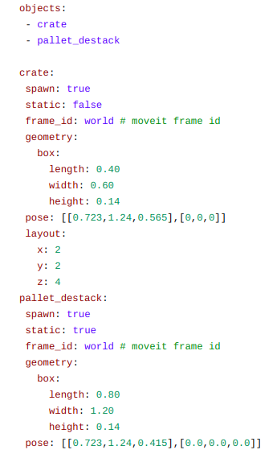
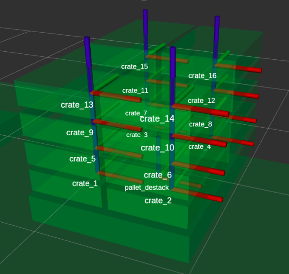

# scene_manager
Scene Manager package is a ROS package created by Robotnik to help build and interact with MoveIt’s robot’s planning scene. 

## Background Info 

### MoveIt Planning Scene

- Is an object used for storing the representation of the world around the robot (external collisions) and also the state of the robot itself (internal collisions and current position).
- The collision environment can be built using MoveIt Collision Objects or Octomap.
- The Planning Scene is used by MoveIt during path planning, to obtain collision-free trajectories. 
- It is important to have an accurate representation of the world. 
- MoveIt allows the user to interact with Collision Objects (attach, detach objects) present in the Planning Scene.  


## Scene Manager

- Facilitates the creation of the Planning Scene, as well as the interaction with the Planning Scene. 
- C++ Class that inherits from the Class moveit::planning_interface::PlanningSceneInterface.
- API that allows user to easily interact with the MoveIt Planning Scene. 

### Advantages

- MoveIt Collision Objects are easily defined in a YAML file that can be modified at any time. 
- Allows user to construct matrices of same object (useful for palletizing applications).
- Adds new functionalities to interact with objects (ex: move relative to object, enable/disable collision checking with object, ..).
- Exposes ROS Services to call all Scene Manager functionalities, external user can easily interact with the environment. 
- Includes visualization in RViz of object names.
- Publishes object's frame with respect to world in TF Tree.

### How to add Scene Manager to a project

- Add [scene_manager](https://github.com/RobotnikAutomation/scene_manager.git) and [scene_manager_msgs](https://github.com/RobotnikAutomation/scene_manager_msgs.git) packages to catkin workspace.
- Inside the ROS package where you are going to use the Scene Manager add the depency to the above packages both in CMakeLists.txt and package.xml files. 
- Add Scene Manager library to the CPP node you are developing: 

    ```
    #include <corosect_manipulation/scene_manager.h>
    ```
- Create object of SceneManager Class:

    ```
    ros::NodeHandle nh;
    // Init Scene Manager
    bool wait = true;
    std::unique_ptr<SceneManager> scene_manager_ = std::make_unique<SceneManager>(nh , wait);
    ```
### Scene Manager YAML:

Allows user to easily add Collision Objects into a Planning Scene, for each object one should add the following attributes:

- **spawn:**  By default the object is added to Planning Scene during initialization of scene by Scene Manager.
- **static:**  Static objects cannot be manipulated, nor its position in space changed. 
- **frame_id:**  Object's position in scene is defined with respect to this axes.
- **geometry:** Geometric shape (box) or route to mesh file (package://ros_package_name/route_to_file_folder/mesh_file_name.stl).
- **pose:**  xyz displacement or rpy orientation with respect to the frame_id axes.
- **layout:** Can be used to add a matrix of the current object (ex: pallet with boxes).


    <p align="justify">
        <div class="row">
          <div class="column">
            
          </div>
          <div class="column">
            
          </div>
        </div>
    </p> 

### Scene Manager Functionalities:

Scene Manager class exposes the following methods:

- **SceneManager::initScene() ->** Adds objects defined in YAML file to the Planning Scene.
- **SceneManager::addObjects(vector< string > object_ids)** -> Add specific object to Planning Scene. 
- **SceneManager::removeObjects(vector< string > object_ids) ->** Remove specific object to Planning Scene.
- **SceneManager::attachObjects(vector< string > object_ids) ->** Attach collision object to end-effector. 
- **SceneManager::detachObjects(vector< string > object_ids) ->** Detach collision object to end-effector. 
- **SceneManager::moveRelativeTo(string object_id, rel_pose) ->** Move end-effector with a relative pose with respect to a given object's frame id.
- **SceneManager::allowCollision(string link_id, vector< string > objects_id) ->** Allows collision between a robot link or a collision object with respect to other collision object. 
- **SceneManager::restoreCollision(string link_id, vector< string > objects_id) ->** Restores collision avoidance between a robot link or a collision object with respect to other collision object. 

### Scene Manager ROS Services:

Scene Manager exposes ROS Services to call all Scene Manager functionalities, external user can easily interact with the arm and the scene. 

- /scene_manager/add_objects
- /scene_manager/remove_objects
- /scene_manager/attach_objects
- /scene_manager/detach_objects
- /scene_manager/modify_object
- /scene_manager/move_relative_to


